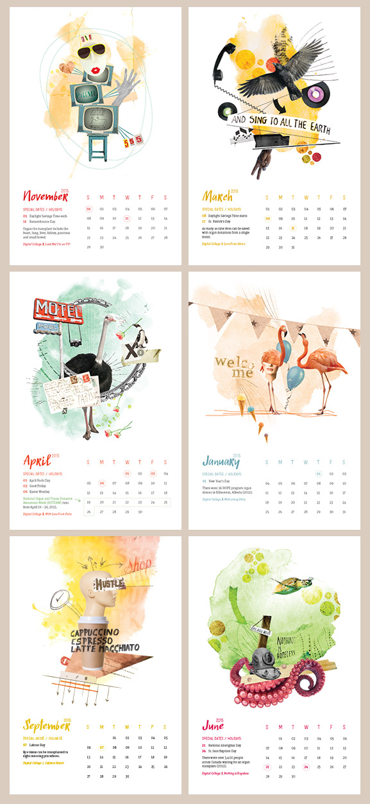

## Chris had a relish for life

By definition, relish means a pleasurable appreciation of anything. My brother had a real relish for life. This is the 9th anniversary of the _calendar for hope_ and as every year past, it has been  put together with great pleasure in preserving the memory of Chris, as well as raising awareness about the importance of organ and tissue donation.

<!---

the 2014 calendar
-->

**Relish 2014 is a 6 x 9 inch calendar packed full of odd & strange illustrations by the creator of the _calendar for hope_, Jess Dupuis (née Hogan).** Jess donates her time, energy and award-winning talent to each illustration with the desire to raise awareness about the need for organ & tissue donation. Everyone can enjoy these conversation-starting pieces of art, so be sure to buy yours today.

## Relish history

This is the most rewarding design project I do and I thank you—my supporters, sponsors, clients, friends and families for your generosity and support. This calendar is successful because people like you make it so.

With your help, over $19,000 has been donated to the HOPE Program. The goal for 2014 is to increase that amount to over $24,000 with the sales of Relish 2014.

The idea was born in 2005 when Jess created a small homemade calendar for family and friends. Entitled Tonal 2006, the calendar featured Jess' art and was made in memory of her little brother, Chris. **Chris was nine years old when he passed away – he was waiting for a liver transplant.**

A close friend who received the calendar wanted to purchase calendars to give to her friends—alas, six additional copies of Tonal 2006 were produced and sold for $6 each. The $36 was donated to U of A's HOPE program and the _calendar for hope_ was born. (A heartfelt thank you to Amy, who unknowingly sparked something so wonderful).

Since that first year, Jess has been committed to making the _calendar for hope_ an annual fundraiser in memory of Christopher. Every year, she produces and sells her unique art-filled calendar with 100% of the proceeds donated to the University of Alberta's [Human Organ Procurement and Exchange Program][ahs] to help raise awareness about the importance of becoming an organ &amp; tissue donor.

Cheers! Jess Dupuis (née Hogan), zando &amp; jot

[ahs]: http://www.albertahealthservices.ca/7627.asp

*[HOPE]: Human Organ Procurement and Exchange